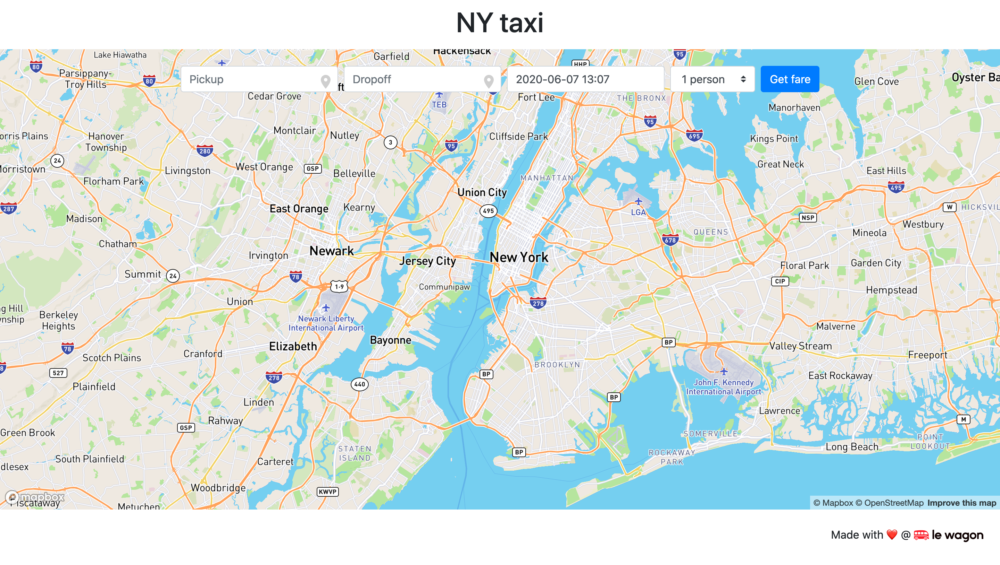

# taxi-fare-interface — NY Taxi Fare prediction frontend



A static, no-framework web interface for the **NY Taxi Fare** prediction API. The user picks pickup/dropoff addresses on a Mapbox-powered map, selects a datetime, and the page calls a prediction API to display the estimated fare.

## Tech

- Pure HTML + CSS + vanilla JS — no build pipeline, no package manager, no bundler.
- [Mapbox GL JS](https://docs.mapbox.com/mapbox-gl-js/api/) for the map and address autocomplete (geocoder).
- [Mapbox Directions API](https://docs.mapbox.com/api/navigation/) to render the driving route between pickup and dropoff.
- [Flatpickr](https://flatpickr.js.org/) for the datetime picker.

The entire app is three files: `index.html`, `style.css`, `script.js`.

## How `script.js` is wired

Five entry-point functions, all called from the bottom of `script.js`:

| Function | What it does |
|----------|--------------|
| `displayMap(start, stop)` | Initialises a Mapbox map centred on NYC. When both coordinates are present, fetches a driving route from the Directions API and renders it as a line layer with start/end circle markers. |
| `pickupAutocomplete()` | Attaches a Mapbox Geocoder to `#pickup`; results land in a hidden `<input>` field. |
| `dropoffAutocomplete()` | Same, for `#dropoff`. Selecting a result triggers `displayMap`. |
| `initFlatpickr()` | Attaches a datetime picker to `#pickup_datetime`. |
| `predict()` | On form submit, assembles a query string from the hidden coordinate fields and `GET`s `taxiFareApiUrl`. The response's `fare` field is rendered in `#predicted-fare`. |

## Configuration

The interface uses three APIs:

1. **NY Taxi Fare prediction API** — for the actual prediction.
2. **MapBox Maps API** — for the map and geocoder autocomplete.
3. **MapBox Directions API** — for the route between pickup and dropoff.

### Set your API endpoints

Two values at the top of `script.js` must be set:

```js
let taxiFareApiUrl = 'https://YOUR_API_URL/predict';   // must be HTTPS in production
mapboxgl.accessToken = 'YOUR_MAPBOX_API_ACCESS_TOKEN';
```

Don't have your own deployed prediction API? Use the Le Wagon hosted one:

```
https://taxifare.lewagon.ai/predict
```

### Mapbox token

Create an account at [mapbox.com](https://www.mapbox.com/), grab an access token from your [account page](https://account.mapbox.com/), and paste it into `script.js`. Tokens given by Le Wagon also work if available.

## Local development

```bash
python -m http.server 5001
```

Open <http://localhost:5001>.

## Deploy on GitHub Pages

```bash
git checkout -b gh-pages
git push origin gh-pages
```

The app will be live shortly at `https://<your-github-nickname>.github.io/taxi-fare-interface`.

## Troubleshooting

| Symptom | Likely cause |
|---------|--------------|
| Console CORS error | The prediction API endpoint must be HTTPS in production. Check the URL. |
| `404` on GitHub Pages right after deploy | Wait ~5 minutes — GitHub sometimes needs time to detect `index.html`. |
| Page loads but predictions silently fail | Browser cache. Open Inspector → Network → disable cache, or try an incognito window. |
